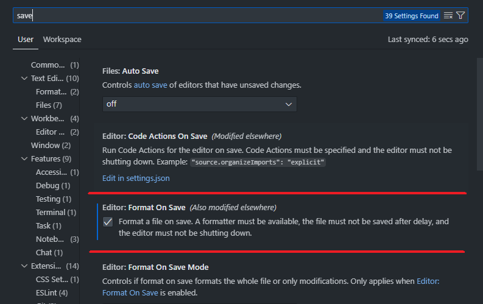

If you have an [Astro](https://astro.build/) project and your Prettier extension in VS Code isn't formatting files on save, fear not. There are just few lines of configuration you need to add. Here are the steps:

1. Make sure you have `Prettier` and `Astro` VS Code extentions installed.
2. In your VS Code Settings `Editor: Format On Save` should be enabled

   

3. Open `settings.json` and make sure `"editor.formatOnSave": true` is present. Fastest way to open the file is:

   - Windows: press `Ctrl` + `Shift` + `P`
   - Mac: press `⌘` + `Shift` + `P`
   - Type `settings.json` into command palette and press `Enter`.

4. In your `settings.json` add this setting:

```js
  "prettier.documentSelectors": ["**/*.astro"],
  "[astro]": {
    "editor.defaultFormatter": "astro-build.astro-vscode"
  }
```

Voila! Go and try it out - `Prettier` should now format your `.astro` files on save.
