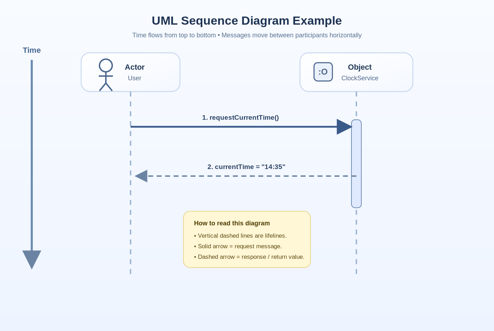

Before picking a framework, spinning up a database, or arguing about microservices vs. monoliths, there's a more fundamental question to answer: **what are we actually building, and under what conditions?**

System requirements and architectural drivers are the answer to that question. They're the inputs that shape every important design decision — not as bureaucratic overhead, but as the foundation that separates a system that happens to work from one that was designed to.

In this note, we'll unpack the main types of requirements, look at practical ways to gather them, and see how they drive the architecture of real systems.

## What We Really Mean by "Requirements"

When people say "requirements", they often bundle a few different things together. For architecture, it's useful to separate them into three buckets:

1. **Functional requirements** – what the system should do.
2. **Quality attributes** – how well it should behave on specific dimensions.
3. **Constraints** – decisions that are already made for us that limit our options.

Each of these pushes the architecture in a different way.

## 1. Functional Requirements: What the System Actually Does

Functional requirements are the easiest to relate to because they describe behavior:

- Users can sign up and log in.
- Customers can place orders.
- Admins can export reports.

In other words, they answer: **"What should the system do for its users?"**

These are the features your stakeholders care about most visibly, and they drive things like domain modeling, APIs, and data flows.

However, a system that only gets the functional side right can still be a nightmare to run. That's where the next category becomes critical.

## 2. Quality Attributes: How the System Behaves Under Pressure

Quality attributes (often called "non-functional requirements") describe **how well** the system behaves rather than what it does. They need to be measurable and specific to be useful. They often include:

- **Performance** – How fast do responses need to be?
- **Security** – How is data protected? Who can do what?
- **Scalability** – How should the system behave as load grows?
- **Reliability** – What happens when a component or dependency fails?

These aren't just nice-to-haves. They are usually the **real** architectural drivers. You don't get high availability, strong security, or low latency as an afterthought.

Two teams could build the exact same set of features, yet end up with completely different architectures depending on their quality attributes. For example:

- A trading platform with strict latency limits will look very different from an internal reporting tool.
- A healthcare app with strong privacy and regulatory requirements will make different architectural choices than a public blog engine.

## 3. Constraints: The Rules You Can't Ignore

Constraints are decisions that are already made for you. They reduce your degrees of freedom, whether you like it or not.

Some common types:

- **Technical constraints** – "We must run on Azure", "We have to integrate with this legacy system", "We use Java in this org".
- **Business constraints** – Budget, deadlines, team size, skill sets. These force trade-offs in both architecture and implementation.
- **Regulatory or legal constraints** – GDPR, HIPAA, region-specific data residency rules, audit requirements.

It's tempting to treat constraints as annoying limitations, but they're actually part of the problem definition. Ignoring them early usually means painful rework later.

One practical mindset shift: instead of asking, *"How do we work around this constraint?"*, ask *"Given this constraint, what's the best architecture we can design?"*

## How to Gather Feature Requirements Without Drowning in Detail

So how do we actually capture what the system needs to do?

Two simple tools go a long way: **use cases** and **user flows**.

### Use Cases

Use cases describe situations or scenarios the system must handle. For example:

- "Customer resets a forgotten password."
- "Admin reviews and approves a new user registration."
- "System notifies a user when their subscription is about to expire."

Use cases help you identify the actors (users, external systems, services) and the high-level interactions between them and your system.

### User Flows

User flows take those use cases and turn them into step-by-step journeys.

They're usually visual: boxes and arrows showing how a user moves through the system to get something done. This is where vague requirements turn into concrete paths.

### A Simple Step-by-Step Process

You don't need a huge process to do this well. Something like this is often enough:

1. **List all the actors** – end users, admins, external systems, third-party services.
2. **Write down the use cases** – what each actor wants to achieve with the system.
3. **Expand into user flows** – for each use case, map the sequence of events.

For each step in a flow, be clear about two things:

- The **action** – what happens.
- The **data** – what is being sent, stored, or transformed.

Once you have that, sequence diagrams become very handy. They show how different components talk to each other over time, which makes it much easier to reason about responsibilities, integration points, and potential bottlenecks.

## Working with Quality Attributes in Real Life

Quality attributes sound abstract until you try to implement them. Then you quickly realize two things:

1. They must be **measurable**.
2. They often **conflict** with each other.

### Make Them Concrete

"The system should be fast" isn't a real requirement. Something like this is:

> 95% of API responses should complete in under 200ms under 1,000 concurrent users.

Now you have something you can design for, test for, and monitor.

### Expect Trade-offs

You won't get every quality attribute at its maximum level. Some classic tensions:

- **Performance vs. Security** – Extra checks, logging, and encryption add overhead.
- **Consistency vs. Availability** – Especially in distributed systems, you often have to choose which one to favor.
- **Simplicity vs. Scalability** – Highly scalable architectures are usually more complex to build and operate.

The key is to be explicit. Decide, with stakeholders, which attributes matter most and in which scenarios. Then design the architecture to favor those.

### Check Feasibility Early

Sometimes, the desired combination of quality attributes just isn't realistic under the given constraints. It's much better to discover that during design than six months into implementation.

Have the uncomfortable conversations early: "Given the budget, timeline, and tech stack, we can do X and Y well, but Z will be limited in these ways."

## Designing With Constraints Instead of Fighting Them

One of the most practical habits for an architect is to treat constraints as first-class citizens in your design.

A powerful way to stay flexible inside those constraints is to aim for **loosely coupled** architectures:

- Clear boundaries between services or modules.
- Well-defined interfaces.
- Minimal knowledge of internal details across components.

Why does this matter? Because constraints **change**:

- A new regulatory rule appears.
- The organization switches cloud providers.
- A previously "temporary" system suddenly becomes critical.

If your architecture is tightly coupled, every change ripples through the entire system. If it's loosely coupled, you have options: you can swap components, redirect flows, or isolate complexity without rewriting everything.

## Wrapping Up

Good architecture doesn't start with technology. It starts with clarity:

- What the system needs to do (functional requirements).
- How well it needs to behave on key dimensions (quality attributes).
- Which decisions are already made for us (constraints).

Once those are understood and written down in a way that's concrete and testable, architectural decisions become much easier to justify — and much easier to defend later when trade-offs are questioned.

